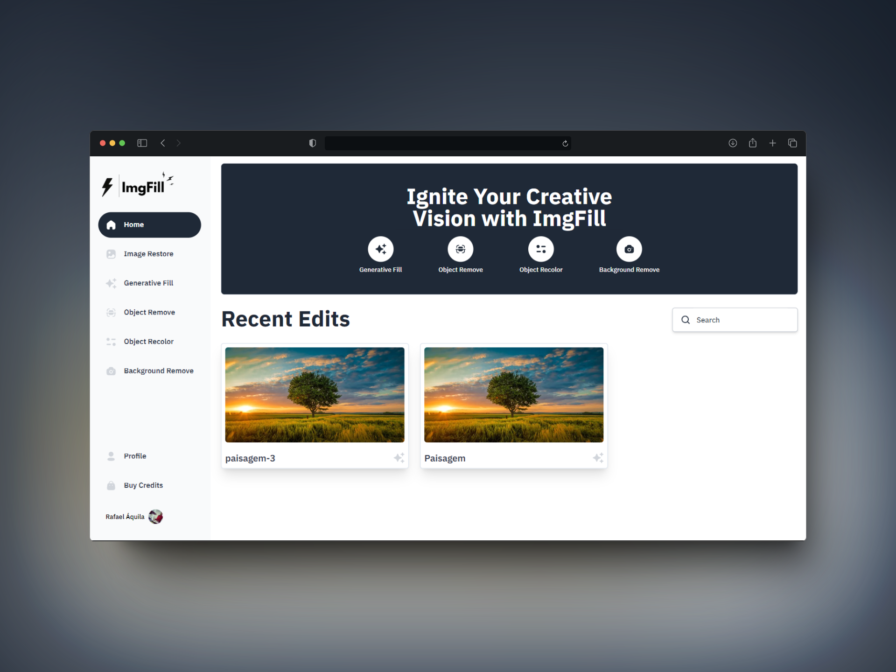

<p align="center">
   
</p>

<h1 align="center">
    <a href="#">ImgFill</a>
</h1>

<p align="center">
    ImgFill is an AI-powered project for enhancing images, removing backgrounds, adjusting proportions, changing colors, and more.
</p>
<p align="center">
  <a href="https://github.com/rafael-bit/imgfill">
  	
  </a>
</p>

# 🚀 How it works

ImgFill leverages artificial intelligence to provide a variety of photo enhancement features. Users can improve image quality, remove backgrounds, modify image proportions, change colors, and access additional powerful functionalities to make their images stand out.

## 👷 Running Locally

#### Clone the repository

```bash
git clone https://github.com/rafael-bit/imgfill
```

#### Install dependencies and run the application in development mode

```bash
yarn
yarn dev
```

Open this address in your browser: [http://localhost:3000](http://localhost:3000/)

# 💻 Technologies

[Next.js](https://nextjs.org/), [Clerk](https://clerk.com/), [Cloudinary](https://cloudinary.com/), [Prisma](https://www.prisma.io/), [Tailwind CSS](https://tailwindcss.com/) e outros AI models for image processing and others.

#  🚩 Bugs

Feel free to **report a new issue** with an appropriate title and description.

# 💡 Author

- Rafael Áquila ([@rafael-bit](https://github.com/rafael-bit))

# 🔧 Contributing

Check the [contribution page](https://github.com/rafael-bit/imgfill/blob/master/CONTRIBUTING.md) for the best places to report issues, start discussions, and contribute.
